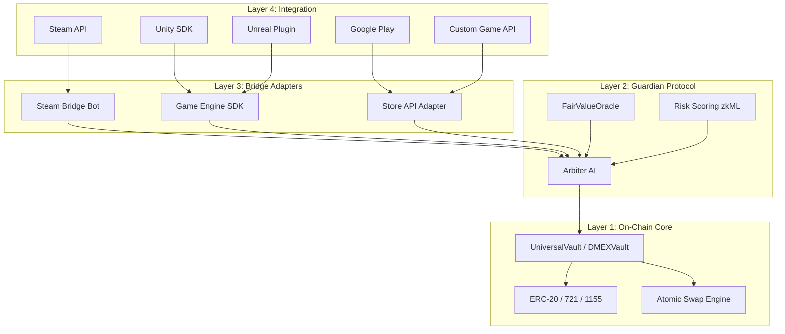
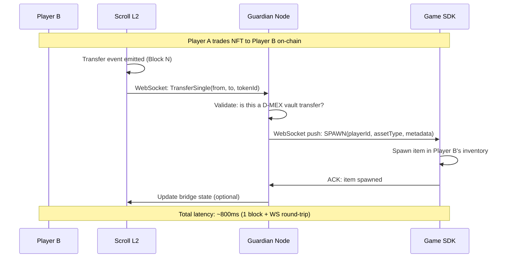

# Chapter Three: System Analysis and Design

## Preamble
This chapter presents the comprehensive system analysis and design for the D-MEX (Decentralised Multi-Asset Exchange) protocol. It details the methodology, architectural choices, and technological frameworks employed to transition the conceptualized secure cross-game barter system into a functional, production-ready decentralized application. The chapter breaks down the implementation strategy mapped directly to the research objectives, outlining the specific methods (ME), theories (TH), models (OD), technologies (OLOG), and activities (Y) utilized in the system's construction. Furthermore, it details the flow of data across the protocol's multi-layered architecture, illustrating how cryptographic primitives and artificial intelligence operate in tandem.

## Problem Formulation

### The Problem Space
Traditional gaming economies and Web3 marketplaces are highly siloed. In-game assets cannot natively traverse across different gaming ecosystems without relying on centralized, trust-based escrow services. This introduces severe custodial risk, as a compromised central database can lead to catastrophic user asset loss. Conversely, fully decentralized peer-to-peer trades expose users to scam vectors, such as partial-fill risks, double-spending during trades, and smart contract vulnerabilities (e.g., reentrancy attacks). Furthermore, existing generalized NFT marketplaces are optimized exclusively for simple Asset-for-ETH trades rather than heterogeneous multi-standard barters involving diverse bundles of ERC-20 (currencies), ERC-721 (unique items), and ERC-1155 (commodities) standards. Beyond technical limitations, users are constantly subjected to cognitive vulnerabilities and behavioral biases (such as FOMO or the Endowment Effect) that malicious actors exploit in unregulated Web3 spaces.

### The Solution Space
The D-MEX protocol introduces a trustless, AI-supervised atomic barter environment designed specifically to bridge distinct GameFi ecosystems. It shifts the burden of trust away from centralized intermediaries by utilizing cryptographic Hash Time-Locked Contracts (HTLCs) acting as an escrow vault. To address cognitive and market-based vulnerabilities, the system integrates a real-time risk assessment pipeline powered by an AI Guardian. The solution ensures that complex multi-asset bundles are transferred atomically—meaning all assets move simultaneously or none at all—while the Guardian actively mitigates market manipulation, prevents double-spends through atomic respawn logic, and flags behavioral biases before a user signs a transaction.

### Aim of the Study
Following the A-B-C-D framework, the primary aim of this research is:
To **[A - develop]** an **[B - atomic barter protocol (D-MEX)]** for **[C - secure, gasless cross-game asset trading]** using **[D - threshold cryptography and AI arbitration]**.

---

## High-Level System Architecture

Before addressing specific objectives, it is necessary to establish the overarching 4-Layer Architecture of the D-MEX Protocol. This modular design isolates the immutable smart contracts from external game engines, ensuring the core protocol remains static while adapters can be infinitely extended.

**Architectural Interaction Flow:**
- **Layer 4**: Any game platform or engine connects via its native API.
- **Layer 3**: Platform-specific adapters translate game operations into standardized D-MEX protocol instructions.
- **Layer 2**: The Guardian AI Server intercepts all instructions, evaluating them through the Arbiter AI, FairValueOracle, and Risk Scoring algorithms.
- **Layer 1**: Approved transactions are pushed to the smart contracts deployed on the Scroll L2 network, executing the trustless atomic swaps natively on-chain.

---

## Objectives Outline

### 3.1 Objective 1: To model a Double-Spend Prevention mechanism for atomic asset transfers
- **ME (Method Employed)**: Prototyping and Mathematical Proof (Cryptographic Hashing).
- **TH (Theories Employed)**: Cryptography (Hash Time-Locked Contracts) and Distributed Ledger Technology.
- **OD (Model Employed)**: Smart Contract Escrow Architecture with Event-Driven Synchronization. The `DMEXVault` contract uses a secret-hash lock where the initiator commits a `sha256(secret)`. The counterparty can only execute the atomic swap by providing the original secret preimage.
- **OLOG (Technologies Employed)**: Solidity, EIP-1153 (Transient Storage for Reentrancy Guards), Scroll Sepolia L2, Yul (Inline Assembly).
- **Y (Activities Embarked On)**: 
  1. **Vault Formulation**: Designing the `commitSwap` and `executeSwap` state machines to strictly enforce the "all-or-nothing" execution paradigm.
  2. **Gas Optimization**: Implementing Yul (inline assembly) loops for cross-asset transfers, circumventing the EVM's expensive storage operations and bypassing non-standard ERC-20 return values.
  3. **Atomic Respawn Mechanics**: Implementing a real-time WebSocket listener that guarantees in-game items only spawn after immutable on-chain confirmation, rendering double-spends mathematically impossible.

**Atomic Respawn Sub-Second Data Flow:**
The following sequence diagram outlines how the Double-Spend Prevention mechanism synchronizes on-chain finality with off-chain game state in under a second (~800ms total latency):

### 3.2 Objective 2: To design a Multi-Operator Threshold validation logic for high-risk operations
- **ME (Method Employed)**: System Modeling and Argumentative Logic.
- **TH (Theories Employed)**: Threshold Cryptography and Multi-Signature Security Models.
- **OD (Model Employed)**: 2-of-3 Threshold Co-signing Process Flow. If an impending transaction's computed risk score exceeds a defined threshold (Risk Score ≥ 50), the system intercepts the automated flow. Rather than unilaterally rejecting or approving, the Arbiter flags the transaction as `pending_co_signer`, requiring a second human operator (acting as a co-signer) to review and manually validate the transaction.
- **OLOG (Technologies Employed)**: Node.js (Guardian Server), ethers.js (ECDSA Cryptographic Signatures).
- **Y (Activities Embarked On)**: 
  1. **Threshold Calibration**: Defining risk boundaries based on historical market variance and behavioral economics.
  2. **Interceptor Logic Integration**: Modifying the Guardian API decision tree to intercept high-risk swap intents before they reach the user's wallet.
  3. **UI Propagation**: Dynamically updating the frontend interface to display the "Swap Requires Human Co-Signer due to high risk!" warning, simulating an enterprise-grade multi-signature workflow.

### 3.3 Objective 3: To develop an AI Guardian Server for real-time risk and behavioral evaluation
- **ME (Method Employed)**: Algorithmic Modeling and API Prototyping.
- **TH (Theories Employed)**: Artificial Intelligence (Heuristic Analysis) and Behavioral Economics.
- **OD (Model Employed)**: Four-Axis Risk Scoring Engine (Value Drain, Reentrancy, Metadata Fraud, Sybil/Wash Trade) operating as a middleware layer.
- **OLOG (Technologies Employed)**: Node.js, Express.js, WebSocket API, Chainlink Price Feeds (Fair Value Oracle).
- **Y (Activities Embarked On)**:
  1. **Building the `DMEXArbiter` Engine**: The AI calculates a composite risk score using weighted matrices: `Composite Risk = (L1 * 0.35) + (L2 * 0.20) + (L3 * 0.20) + (A3 * 0.25)`.
  2. **Psychology & Defaults Integration**: Designing algorithms to detect specific human cognitive vulnerabilities based on the payload data:
     - *Endowment Effect*: Flagged if the offered asset's perceived value exceeds 2.5x the requested asset's fair market value.
     - *Loss Aversion*: Triggered if a swap commits more than a defined percentage of a user's total portfolio.
     - *FOMO/Urgency*: Detected by tracking execution frequency (e.g., ≥ 3 trades in a 5-minute window).
  3. **Data Streaming Pipeline**: Constructing the WebSocket broadcast pipeline to push risk scoring, attack node matrices, and psychological warnings to connected clients instantly without polling overhead.

### 3.4 Objective 4: To implement a frontend GameFi marketplace interface with analytics synchronization
- **ME (Method Employed)**: Rapid Application Development (RAD) and User Studies.
- **TH (Theories Employed)**: Human-Computer Interaction (HCI) and Information Systems Design.
- **OD (Model Employed)**: Client-Server Architecture utilizing a Glassmorphic UI/UX paradigm and asynchronous state management.
- **OLOG (Technologies Employed)**: HTML5, CSS3 (Vanilla Native), JavaScript (ESM), Canvas API.
- **Y (Activities Embarked On)**:
  1. **Interface Construction**: Designing and laying out the "Propose Intent", "Open Market", and interactive "Analytics" dashboards using a modular, component-based approach within raw HTML/JS.
  2. **Real-time State Sync**: Mapping incoming WebSocket messages directly to DOM elements to render animated charts and KPI metrics dynamically.
  3. **RPC Resilience**: Integrating multi-RPC failover arrays with exponential backoff algorithms. If the primary Scroll network node fails or rate-limits requests, the application automatically cycles to secondary nodes, guaranteeing uninterrupted connectivity and a seamless user experience.

### 3.5 Objective 5: To evaluate the protocol's security and performance under simulated conditions (Evaluation Objective)
- **ME (Method Employed)**: Simulation Experiments and Inferential Statistics.
- **TH (Theories Employed)**: Software Engineering (Test-Driven Development) and Cyber Security Analysis.
- **OD (Model Employed)**: Invariant and Fuzz Testing Matrix mapped to the 7-Layer Threat Model.
- **OLOG (Technologies Employed)**: Foundry Test Suite (`forge test`).
- **Y (Activities Embarked On)**:
  1. **Stateful Invariant Testing**: Formulating 5 critical invariants (e.g., Vault Solvency, No Double Finalization) and bombarding the smart contracts with 640,000 randomized execution sequences to mathematically prove the absence of systemic logic flaws.
  2. **Fuzz Testing**: Stress-testing the protocol with 5,000 algorithmic iterations per function. This specifically targeted the HTLC secret revelation paths, signature replay vulnerabilities, and multi-asset bundle atomicity.
  3. **Gas Profiling**: Measuring and optimizing execution costs to ensure all `commitSwap` and `executeSwap` functions stay well below the Scroll L2 30M gas limit constraints (optimizations successfully reduced average swap execution to ~83,000 gas).
  4. **Live Network Deployment**: Migrating the final proxy contracts to the Scroll Sepolia testnet to verify end-to-end multi-party execution latency and real-world behavior in a chaotic network environment.
