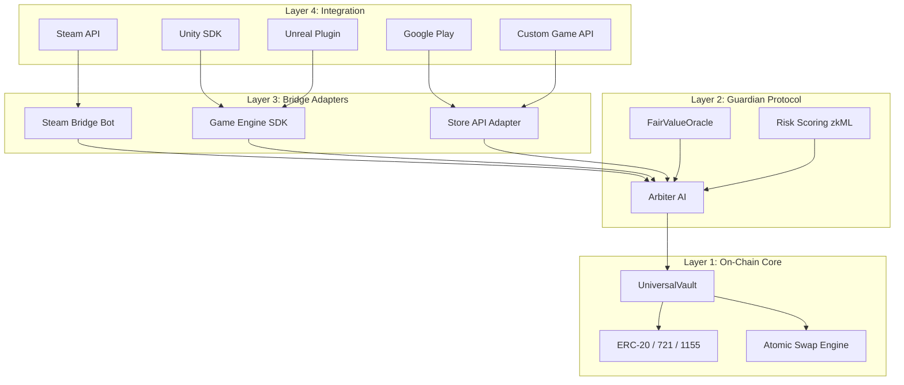

# D-MEX Protocol — 4-Layer Architecture

## How It Works

- **Layer 4** — Any game platform connects via its native API
- **Layer 3** — Platform-specific adapters translate game operations into D-MEX protocol calls
- **Layer 2** — The Guardian AI validates, scores, and authorizes every operation
- **Layer 1** — The smart contracts on Scroll L2 execute trustless atomic swaps

**Key insight**: Adding a new game = writing a new Layer 3 adapter. The protocol (Layers 1-2) never changes.
