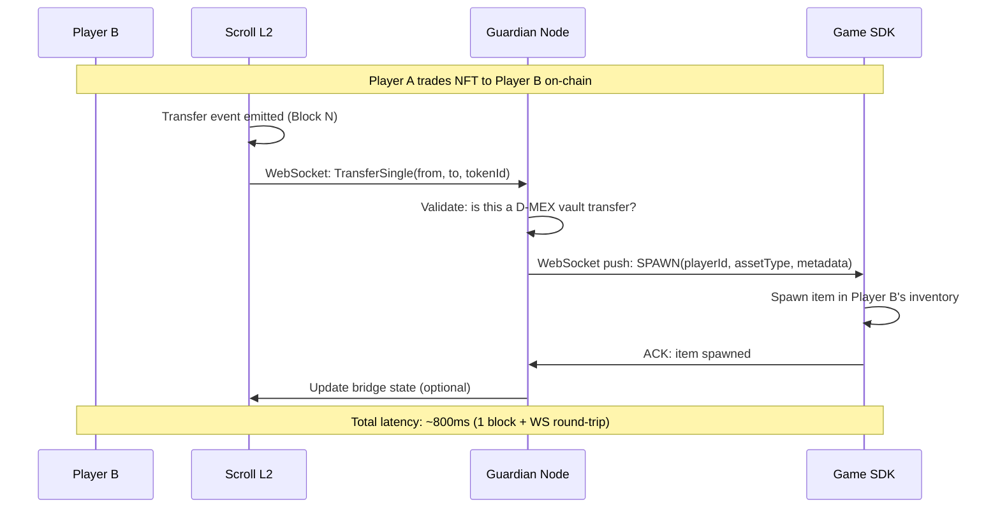

# D-MEX Atomic Burn → Respawn Flow

## Sub-Second Asset Transfer Sequence



## Transfer Event Listener (Guardian)

```javascript
// Listen for ALL transfers on D-MEX token contracts
const tokenContracts = [DGLD, NFT_SWORD, COMMODITY];
tokenContracts.forEach(contract => {
    contract.on('Transfer', async (from, to, tokenIdOrAmount, event) => {
        // Only process D-MEX vault transfers
        if (from === VAULT_PROXY || to === VAULT_PROXY) {
            const spawnInstruction = {
                type: 'asset_spawn',
                recipient: to,
                asset: resolveAssetType(contract.target),
                amount: tokenIdOrAmount.toString(),
                txHash: event.transactionHash,
                timestamp: Date.now()
            };
            // Push to all connected game SDKs
            broadcastWS(spawnInstruction);
        }
    });
});
```

## Double-Spend Prevention Rules

| Rule | Enforcement |
|------|------------|
| NFT can only be traded if it exists | ERC-721 `ownerOf()` check — on-chain, trustless |
| Burn destroys the NFT permanently | `_burn()` in smart contract — irreversible |
| Game item only spawns on confirmed transfer | Guardian waits for block confirmation before pushing |
| Same NFT can't trigger two spawns | Guardian tracks `txHash` → deduplicates events |

## Why No ZK Needed for On-Chain Games

For blockchain-native games (Loot, Gods Unchained, CryptoKitties), ownership is **already provable on-chain**:
- Call `ownerOf(tokenId)` on the Loot contract → returns the owner address
- No trusted oracle, no bridge bot, no ZK proof needed
- The blockchain IS the source of truth

D-MEX simply reads the contract state directly. This is **fully trustless** by default for on-chain games.
